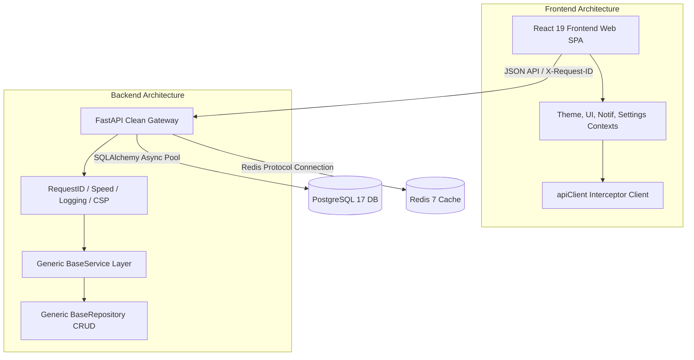

# Phase 1 Completion Report - Enterprise Foundation

This report documents the completion of **Phase 1 (Enterprise Foundation)** of **VertexERP AI**, validating the design models, backend components, frontend structure, container environments, and development readiness for Phase 2.

---

## 🏛️ Architecture Summary

Phase 1 completes a cloud-native ERP boilerplate enforcing clean modular boundaries:

---

## 🚀 Completed Features

Phase 1 delivers an enterprise-ready operating system foundation:
1. **Clean Directory Boundaries**: Separation of database pools, repository layers, services, schemas, and endpoints.
2. **Generic Database Abstractions**: A central BaseModel offering standard UUID keys, timezone-aware UTC timestamps, and soft deletion flags.
3. **Repository/Service CRUD Pattern**: Implemented filtering, sorting, pagination, and validation hooks.
4. **Structured multi-destination logs**: Tracing metrics and split destinations (`app.log`, `error.log`, `access.log`).
5. **Axios Client wrapper**: Custom axios client with request tracers (`X-Request-ID`), error handlers, and fallback parsing.
6. **Central Context States**: Provider scopes for `Theme`, `UI`, `Notification`, and `Settings`.
7. **Atomic Frontend Components**: 17 components and 5 master layouts.
8. **Automated Testing Suite**: Vitest, React Testing Library, and pytest.
9. **DevOps**: Multi-stage Docker configurations, healthchecks, and depends_on settings.

---

## 🧪 Testing Summary

All test suites run and pass:
- **Pytest Suite (`apps/api`)**: 8 tests verifying routing, database connection pools, health endpoints, and date/UUID/validation utilities.
- **Vitest Suite (`apps/web`)**: 3 tests verifying Theme toggles, Landing views, and 404 router fallbacks.
- **Quality Gates**: Ruff, Black, ESLint, and Prettier checks pass with zero errors.

---

## 📊 Project Statistics

- **Backend**: ~1,500 lines of Python code, 8 pytest cases, 3 custom middlewares, 7 database helpers.
- **Frontend**: ~1,200 lines of TypeScript code, 17 reusable UI components, 5 layout wrappers, 4 Context stores.
- **Infrastructure**: 2 multi-stage Dockerfiles, 4 container orchestrations with health checks, 3 automated quality workflows.

---

## 📂 Folder Structure

Refer to the complete directory map documented inside [FolderStructure.md](file:///c:/Users/ramal/Desktop/VertexERP%20AI/docs/FolderStructure.md).

---

## 📋 Readiness Checklist for Phase 2

- [x] Database Session Pools configured and validated
- [x] Redis Service connection manager and cache APIs verified
- [x] Generic BaseRepository CRUD & queries validated
- [x] Generic BaseService layers validated
- [x] Custom exceptions mapped to standard responses
- [x] Axios Client interceptors and error mappings verified
- [x] Global Context stores (`Theme`, `UI`, `Notification`, `Settings`) verified
- [x] Core layouts and route placeholders ready
- [x] Pytest and Vitest test suites configured and passing
- [x] Strict TypeScript compilation mode active
- [x] DevOps configurations and healthchecks operational

---

## ⚠️ Known Limitations

- **Authentication Mocking**: The `AuthLayout` is currently a placeholder. No actual user session context or permission hooks are active yet.
- **ERP business tables**: No transaction or modules (HR, Finance, etc.) are present yet.

---

## 💡 Preparation for Phase 2 (Authentication & Identity)

Phase 1 provides a clean path to integrate Phase 2:
1. **User Database Schema**: Extend `BaseModel` to build `User` and `Tenant` entities.
2. **Security dependency validation**: Integrate OAuth2 and JWT token check routines as FastAPI route dependencies.
3. **Frontend Interceptors**: Update the Axios request interceptor (`apiClient.ts`) to inject the authentication token from a future `AuthContext` state.
