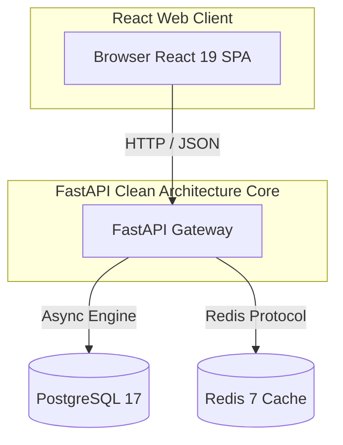

# Architectural Design Document - VertexERP AI

This document specifies the software architecture design for **VertexERP AI** (Enterprise AI Operating System), outlining layers, communication patterns, and design patterns.

## Technical Architecture Overview

VertexERP AI utilizes a **Monorepos (Single Repository) Architecture** housing modular services under decoupled structures.

---

## Backend Clean Architecture

The backend project structure enforces a decoupled directory boundary separation to isolate operational logic, configurations, and communication routes:

- **`app/core/`**: Configuration configurations (via `pydantic-settings`) and logging initializers. Keeps settings immutable.
- **`app/api/`**: Router definitions and API route endpoints (version, health). Implements serialization parameters.
- **`app/database/`**: Engine instantiation, async session generators (`get_db`), and Redis cache drivers.
- **`app/middleware/`**: CORS access settings, exception managers, and query interceptors.
- **`app/repositories/`**: Base query interface implementing the **Repository Pattern** to decouple SQL execution from core business services.
- **`app/services/`**: Orchestrates transactions and maps domain transformations.
- **`app/schemas/`**: Pydantic model contracts representing incoming request parameter validation and outgoing serialization schemas.
- **`app/models/`**: SQLAlchemy declarative databases and table schemas.
- **`app/utils/`**: Shared static library helper logic.

---

## Frontend Monolith-SPA Design

The client panel uses a modular Component-Layout-Page separation:

- **`src/app/`**: Global runtime setups (context engines, providers).
- **`src/components/`**: Atomic visual features (buttons, forms, indicator badges, charts).
- **`src/layouts/`**: Core wireframe grids (Navbar headers, side navigations, footers).
- **`src/pages/`**: Complete router page views (Overview, dynamic workspace placeholders, 404).
- **`src/services/`**: API fetching clients built with TanStack Query.
- **`src/hooks/`**: Specialized React hooks (e.g. `useTheme` managing light/dark preferences).
