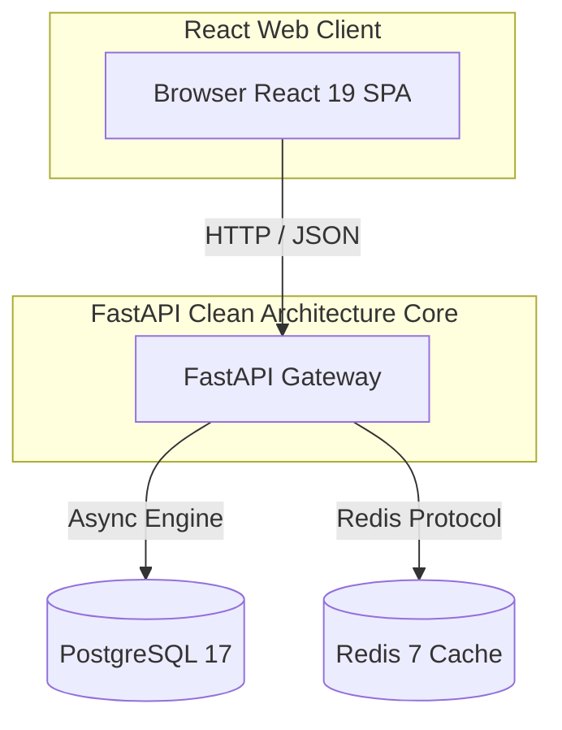

# Architectural Design Document - VertexERP AI

This document specifies the software architecture design for **VertexERP AI** (Enterprise AI Operating System), outlining layers, communication patterns, and design patterns.

## Technical Architecture Overview

VertexERP AI utilizes a **Monorepos (Single Repository) Architecture** housing modular services under decoupled structures.

---

## Backend Clean Architecture

The backend project structure enforces a decoupled directory boundary separation to isolate operational logic, configurations, and communication routes:

- **`app/core/`**: Configuration management (via `pydantic-settings` Settings class validating environments), context tracking (`context.py`), dependency injection (`dependencies.py`), custom exceptions (`exceptions.py`), and structured logging (`logging.py`).
- **`app/api/`**: Router definitions and versioned endpoints (`health.py`, `version.py`). All responses are serialized using standard JSON `APIResponse` schemas.
- **`app/database/`**: Database connection pool setups, abstract `BaseModel` containing UUID and timezone-aware timestamp mixins, soft delete capabilities (`base.py`), and connection managers/caching APIs via `RedisService` (`redis.py`).
- **`app/middleware/`**: CORS settings, custom middlewares (Request ID, Processing Time, Access Logging, and Security Headers), and global exception interrupters formatting error responses.
- **`app/repositories/`**: Generic `BaseRepository` implementing async CRUD operations, dynamic sorting, pagination, and filtering abstractions.
- **`app/services/`**: Generic `BaseService` managing service logic, validation hooks, and repository triggers.
- **`app/schemas/`**: Pydantic v2 schemas validating request parameters, documenting endpoints, and defining response structures (`response.py`).
- **`app/utils/`**: Utilities for dates, UUID validation, pagination metadata, standard responses, and validation checks.
- **`app/models/`**: SQLAlchemy declarative databases and table schemas.

---

## Frontend Monolith-SPA Design

The client panel uses a modular Component-Layout-Page separation:

- **`src/app/`**: Global runtime setups (context engines, providers).
- **`src/components/`**: Atomic visual features (buttons, forms, indicator badges, charts).
- **`src/layouts/`**: Core wireframe grids (Navbar headers, side navigations, footers).
- **`src/pages/`**: Complete router page views (Overview, dynamic workspace placeholders, 404).
- **`src/services/`**: API fetching clients built with TanStack Query.
- **`src/hooks/`**: Specialized React hooks (e.g. `useTheme` managing light/dark preferences).

---

## Phase 3: Organization Management Platform Architecture
- **Hierarchical Self-Referential Graph Topology**: Database tables (`branches`, `departments`, `teams`) support parent-child self-references. Services execute hierarchy loop validations (preventing cycles) before updating or creating parent structures.
- **Service-Repository Decoupling**: Database interactions inherit from `BaseRepository`, while complex domain constraints, bulk actions, and storage uploads reside in the `Service` layer.
- **CSV Data Interface**: Endpoints support data import/export formats. The service handles parsing and creation validation bounds.
- **File Storage Abstraction**: The `DocumentService` encapsulates local storage save logic and wraps interfaces for cloud bucket storage provider extensions.

---

## Phase 5: CRM Intelligence Platform Architecture
- **Predictive AI Telemetry Hook Design**: Relational schemas for Leads, Deals, Support Tickets, and Campaigns are structured with telemetry indexes. These design choices prepare records for future ML Lead Scoring and Churn Predictions without introducing raw model code or packages prematurely.
- **Transactional Quotation Versioning**: Deals capture expected valuations while Quotations allow multiple version sequences linked to the parent deal, preserving historical terms and pricing schedules.
- **Deduplication Check Mechanics**: Lead creation endpoints trigger verification queries to detect duplicate contact details under the active organization tenant before registering new items.
