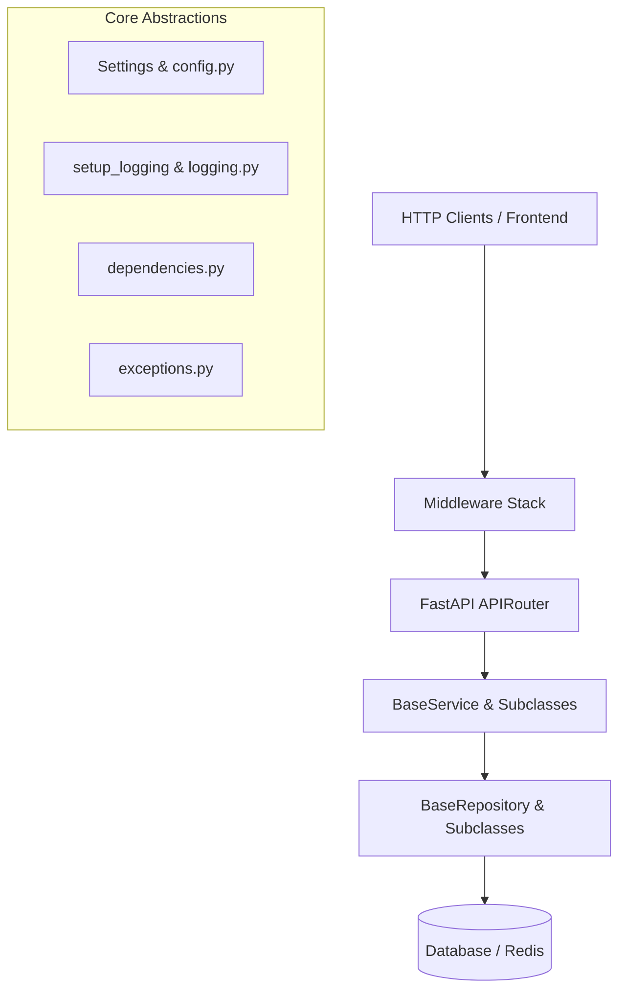

# Backend Architecture Guide - VertexERP AI

This guide details the backend architecture implemented in **Sprint 1.2 (Enterprise Backend Foundation)**.

---

## 🏗️ Clean Architecture Organization

The API backend enforces directory isolation to separate logical concerns and maintain the integrity of business modules:



---

## ⚙️ Configuration & Environment Control

Configuration parameters are managed in [config.py](file:///c:/Users/ramal/Desktop/VertexERP%20AI/apps/api/app/core/config.py) via a centralized `Settings` class using `pydantic-settings`. 

- **Environment Isolation**: The runtime environment is validated through the `ENVIRONMENT` property (`development`, `testing`, `production`).
- **Connection Pools**: Specifies optimized pool size boundaries for SQLAlchemy PostgreSQL (`POSTGRES_POOL_SIZE` = 20, `POSTGRES_MAX_OVERFLOW` = 10) and Redis (`REDIS_MAX_CONNECTIONS` = 20).
- **Graceful Failure**: Setting rules and formats are checked during application startup. If configurations are incorrect, startup throws a clear `RuntimeError`.

---

## 📝 Multi-Destination Structured Logging

The logging architecture [logging.py](file:///c:/Users/ramal/Desktop/VertexERP%20AI/apps/api/app/core/logging.py) splits logging outputs based on gravity and context:

1. **Console Logs**: Streamed to `stdout` containing timestamps, severity, thread namespaces, request IDs, and message details.
2. **Application File Logs (`logs/app.log`)**: Captures general system operations (`INFO` and above) with a rotating boundary (10MB limit, 5 history backups).
3. **Error File Logs (`logs/error.log`)**: Focuses on failures (`ERROR` and above) for monitoring and alerts.
4. **Access File Logs (`logs/access.log`)**: Captures HTTP access routes and response times (bypassing the root logger to avoid double logging).

---

## ⚡ Global Exception Mapping & Response Standards

### Custom Exceptions
All custom errors derive from `BaseException` (defined in [exceptions.py](file:///c:/Users/ramal/Desktop/VertexERP%20AI/apps/api/app/core/exceptions.py)), standardizing HTTP status mapping:
- `ValidationException` (HTTP 422)
- `NotFoundException` (HTTP 404)
- `ConflictException` (HTTP 409)
- `UnauthorizedException` (HTTP 401)
- `ForbiddenException` (HTTP 403)
- `InternalServerException` (HTTP 500)

### Response Serialization Envelope
All API endpoints serialize outputs inside the generic `APIResponse` class (defined in [response.py](file:///c:/Users/ramal/Desktop/VertexERP%20AI/apps/api/app/schemas/response.py)):
```json
{
    "success": true,
    "message": "Operation description summary",
    "data": {},
    "meta": {},
    "timestamp": "2026-07-24T22:00:00Z"
}
```

---

## 🛡️ Middleware Stack

The middleware pipeline (defined in [custom.py](file:///c:/Users/ramal/Desktop/VertexERP%20AI/apps/api/app/middleware/custom.py)) intercept requests and responses sequentially:

1. **CORSMiddleware** *(Outermost)*: Governs access control and validates origins.
2. **RequestIDMiddleware**: Inspects or generates unique UUID request tracers (`X-Request-ID`), binding them to a `contextvars.ContextVar` for request tracking.
3. **ProcessingTimeMiddleware**: Registers duration stamps and inserts `X-Process-Time` into response headers.
4. **AccessLoggingMiddleware**: Audits incoming parameters and outgoing codes to the access logger.
5. **SecurityHeadersMiddleware** *(Innermost)*: Hardens headers (`X-Frame-Options: DENY`, `X-Content-Type-Options: nosniff`, `Referrer-Policy`, etc.).

---

## 💾 Database and Caching Foundations

### SQLAlchemy Base & Mixins
Defined in [base.py](file:///c:/Users/ramal/Desktop/VertexERP%20AI/apps/api/app/database/base.py), the `BaseModel` abstract class builds common table components:
- **UUID Keys**: Incorporates `UUIDMixin` specifying primary key `id` via `uuid4`.
- **Timestamp Auditing**: Incorporates `TimestampMixin` specifying `created_at` and `updated_at` (UTC timezone-aware).
- **Soft Deleting**: Integrates `SoftDeleteMixin` providing `is_deleted` and `deleted_at` attributes.

### Caching and Connection Management
The [RedisService](file:///c:/Users/ramal/Desktop/VertexERP%20AI/apps/api/app/database/redis.py) class acts as connection pooling supervisor and caching provider:
- Controls connection lifespan via `initialize()` and `close()`.
- Implements async ping healthchecks.
- Handles automated JSON serialization/deserialization for caching methods (`get`, `set`, `delete`, `exists`, `expire`, `flush`).

---

## 🔄 Repository and Service Layers

### Generic Repository (`BaseRepository`)
The repository [base.py](file:///c:/Users/ramal/Desktop/VertexERP%20AI/apps/api/app/repositories/base.py) isolates raw SQL query executions from business concerns:
- Implements standard CRUD operations.
- Translates dynamic parameters into SQLAlchemy async syntax for sorting, skip/limit pagination, and filter mappings.
- Filters out soft-deleted items by default.

### Generic Service (`BaseService`)
The service [base.py](file:///c:/Users/ramal/Desktop/VertexERP%20AI/apps/api/app/services/base.py) encapsulates business validation checkpoints:
- Calls `validate_create`, `validate_update`, and `validate_delete` hooks before saving changes.
- Coordinates database query boundaries.
