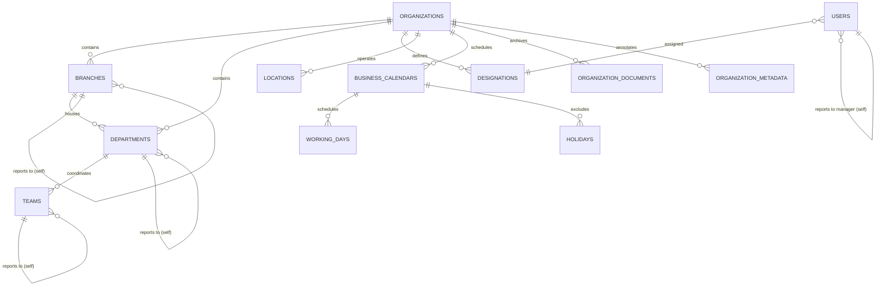

# Entity Relationship Diagram (ERD)

This document contains a Mermaid entity-relationship diagram of all Phase 3 database schemas.

### Key Relationships
*   **Self-Referencing Parent Fields**: `branches`, `departments`, and `teams` implement hierarchical parenthood keys with cyclic logic validation checks in services.
*   **User Assignment**: `users` maps back to `designations` (job roles) and self-references another user via `manager_id` to generate recursive tree structures.
