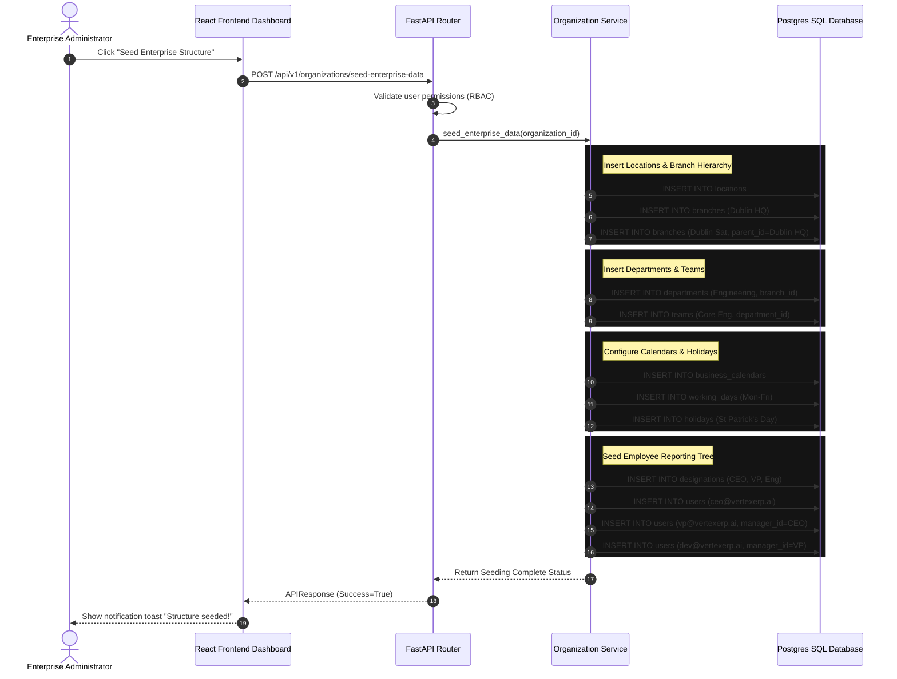

# Sequence Diagrams

This document outlines sequence flows for seeding enterprise organization data.

## Seeding Enterprise Data Flow

```mermaid
sequenceDiagram
    autonumber
    actor Admin as Enterprise Administrator
    participant UI as React Frontend Dashboard
    participant API as FastAPI Router
    participant Serv as Organization Service
    participant DB as Postgres SQL Database

    Admin->>UI: Click "Seed Enterprise Structure"
    UI->>API: POST /api/v1/organizations/seed-enterprise-data
    API->>API: Validate user permissions (RBAC)
    API->>Serv: seed_enterprise_data(organization_id)
    
    rect rgb(20, 20, 20)
        note right of Serv: Insert Locations & Branch Hierarchy
        Serv->>DB: INSERT INTO locations
        Serv->>DB: INSERT INTO branches (Dublin HQ)
        Serv->>DB: INSERT INTO branches (Dublin Sat, parent_id=Dublin HQ)
    end

    rect rgb(20, 20, 20)
        note right of Serv: Insert Departments & Teams
        Serv->>DB: INSERT INTO departments (Engineering, branch_id)
        Serv->>DB: INSERT INTO teams (Core Eng, department_id)
    end

    rect rgb(20, 20, 20)
        note right of Serv: Configure Calendars & Holidays
        Serv->>DB: INSERT INTO business_calendars
        Serv->>DB: INSERT INTO working_days (Mon-Fri)
        Serv->>DB: INSERT INTO holidays (St Patrick's Day)
    end

    rect rgb(20, 20, 20)
        note right of Serv: Seed Employee Reporting Tree
        Serv->>DB: INSERT INTO designations (CEO, VP, Eng)
        Serv->>DB: INSERT INTO users (ceo@vertexerp.ai)
        Serv->>DB: INSERT INTO users (vp@vertexerp.ai, manager_id=CEO)
        Serv->>DB: INSERT INTO users (dev@vertexerp.ai, manager_id=VP)
    end

    Serv-->>API: Return Seeding Complete Status
    API-->>UI: APIResponse (Success=True)
    UI-->>Admin: Show notification toast "Structure seeded!"
```
