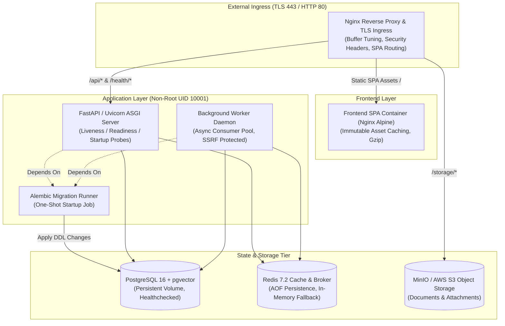

# VertexERP AI V2 - Production Infrastructure Architecture

**Document Version:** 2.0.0  
**Target Environments:** Development, Staging, Production  
**Deployment Models:** Docker Compose (Single-Host / Appliance), Kubernetes (Single-Cluster Enterprise Cloud)

---

## 1. Architectural Philosophy & Principles

VertexERP AI V2 infrastructure is engineered around **real-world production reliability, explicit security, and pragmatic operations**:

1. **No Fake High-Availability (HA) or Multi-Region Claims:**
   - Database operations rely on strict ACID transactions with PostgreSQL 16 + pgvector. Claims of multi-region active-active database clustering without cross-region quorum write penalties are physically unrealistic for relational double-entry ERP ledgers.
   - We specify a robust, realistic **Single-Region Multi-AZ Single-Cluster** topology with automated backups, point-in-time recovery (PITR), and stateless horizontal pod autoscaling.
2. **Deterministic Startup & Migration Invariant:**
   - Database schema migrations (`alembic upgrade head`) execute in an isolated, one-shot container/job (`migration`).
   - The API server and Background Worker pools strictly depend on `condition: service_completed_successfully` (Docker) or `initContainers / Pre-Install Helm Hooks` (Kubernetes). They never boot against un-migrated schemas.
3. **Hardened Multi-Stage Container Runtime:**
   - Zero root container execution. All application containers execute as `appuser:appgroup` (UID/GID 10001).
   - Build toolchains (gcc, build-essential, header files) are discarded in the builder stage.
   - Signal forwarding and zombie process reaping are managed by `tini`.
4. **Resilient Health & Graceful Shutdown:**
   - Dedicated probes: Startup (`/health/startup`), Liveness (`/health/live`), Readiness (`/health/ready` with DB/Redis active checks).
   - Uvicorn and Worker processes handle SIGTERM/SIGINT with a 30–45s drain window, ensuring active HTTP requests and running async jobs complete before process termination.

---

## 2. Environment Matrix

| Dimension | Development | Staging | Production |
| :--- | :--- | :--- | :--- |
| **Compose File** | `docker-compose.yml` | `docker-compose.staging.yml` | `docker-compose.prod.yml` |
| **Configuration** | `.env` / `.env.development.example` | `.env.staging.example` | `.env.production.example` / Vault |
| **Debug Mode** | `true` | `false` | `false` (Strictly enforced) |
| **API Docs (`/docs`)** | Enabled | Enabled (Restricted) | Disabled |
| **CORS Origins** | `localhost:3000`, `localhost:5173` | `*.staging.vertexerp.io` | Strict Whitelist (Zero Wildcards) |
| **Rate Limiting** | Permissive (500/min) | Enforced (20-60/min) | Strict (10-30/min, 429 Retry-After) |
| **Workers Concurrency** | 4 (Local async loop) | 8 (2 Staging instances) | Horizontal Auto-Scaling (2–8 pods) |
| **Reverse Proxy** | Direct port exposure | Nginx Staging Proxy | Nginx Production Proxy / K8s Ingress |

---

## 3. Container Topology Diagram



---

## 4. Kubernetes Deployment Specification

For Kubernetes deployments (`infra/k8s/`):
1. **`namespace.yaml`**: Namespaced isolation `vertexerp-production`.
2. **`configmap.yaml` & `secret.template.yaml`**: Decoupled non-sensitive environment variables from encrypted secrets.
3. **`migration-job.yaml`**: One-shot Kubernetes `batch/v1 Job` executing schema migrations.
4. **`api-deployment.yaml`**: Multi-replica Deployment with HorizontalPodAutoscaler (CPU 70%, Memory 80%), PodDisruptionBudget (`minAvailable: 2`), and structured HTTP probes.
5. **`worker-deployment.yaml`**: Dedicated worker pool Deployment with `terminationGracePeriodSeconds: 45`.
6. **`frontend-deployment.yaml`**: Lightweight Nginx static file server with `/healthz` checks.
7. **`ingress.yaml`**: Production Ingress controller with TLS certificate auto-provisioning via `cert-manager`.

---

## 5. Operations & Runbooks

### 5.1 Secrets Generation & Bootstrapping
```bash
# Generate cryptographically secure tokens:
python scripts/generate_secrets.py

# Populate production environment:
cp .env.production.example .env.production
# Edit .env.production with the generated values
```

### 5.2 Local Production Container Validation
```bash
# Validate infrastructure syntax and invariants:
python scripts/validate_infra.py

# Run development compose stack:
docker compose up -d

# Run production compose stack:
docker compose -f docker-compose.prod.yml up -d
```

### 5.3 Database Backup & Restore Runbook
```bash
# PostgreSQL Backup (Compressed Custom Format):
docker exec -t vertexerp-postgres-prod pg_dump -U vertex_prod_app -Fc vertexerp_production > backup_$(date +%Y%m%d_%H%M%S).dump

# PostgreSQL Restore:
docker exec -i vertexerp-postgres-prod pg_restore -U vertex_prod_app -d vertexerp_production --clean backup_20260911_120000.dump
```
