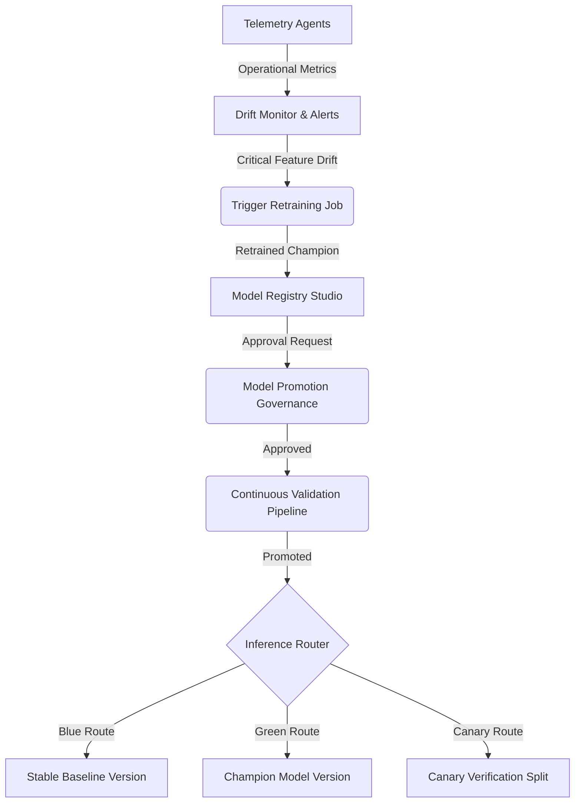

# VertexERP AI MLOps Platform Guide

Welcome to the Enterprise MLOps Platform Guide for VertexERP AI. This document outlines the system architecture, model lifecycles, and key processes that govern continuous integration, continuous delivery, and continuous validation of machine learning models.

---

## 1. Platform Architectural Design

The MLOps platform decouples business machine learning operations from low-level cloud-specific providers. It establishes clean abstractions for model registration, promotion, retraining, deployment, rollback, and drift monitoring.

---

## 2. Model Lifecycles

All model versions undergo five primary lifecycles:
1. **Development (`DRAFT` / `CANDIDATE`)**: Local experiments, notebook validations, and hyperparameter logs.
2. **Testing (`TESTING`)**: Automatic verification pipelines validation, mock testing inputs, integration assert testing.
3. **Staging (`STAGING`)**: Shadow routing and compliance audits.
4. **Production (`PRODUCTION`)**: Active endpoints, Blue-Green/Canary split configurations.
5. **Archived / Deprecated (`ARCHIVED` / `DEPRECATED`)**: Read-only history records, retired endpoint roots.

---

## 3. Governance and Security Rules

Model promotion is strictly secured:
- **RBAC Controls**: Only users with `Principal AI Architect` or `Lead MLOps Engineer` roles can decide on promotion approvals.
- **Audit Logs**: All deployment creation, rollback actions, and approval decisions log details into the `audit_logs` database table.
- **Compliance Checklist**: Bias audits, licensing compliance checks, explainability report generation, and ownership logs must exist before production approvals.
