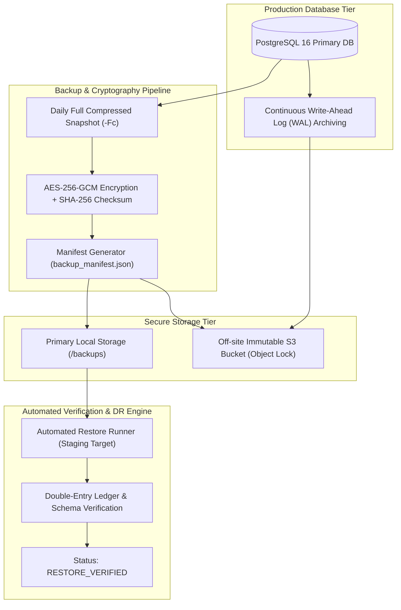

# VertexERP AI V2 - Disaster Recovery & Database Backup Policy

**Document Identifier:** `VER-OPS-DR-2026-09`  
**Classification:** Enterprise Security & Business Continuity Directive  
**Target Environment:** Staging, Production  
**Core Invariant:** *"A backup is not considered valid until a restore has been tested."*

---

## 1. Executive Summary & Recovery Objectives

VertexERP AI V2 enforces an immutable business continuity architecture designed to safeguard enterprise multi-tenant financial ledgers, inventory balances, supply chain records, and AI knowledge bases.



### Recovery Metrics & Service Level Agreements (SLAs)

| Objective | Target Requirement | Operational Strategy |
| :--- | :---: | :--- |
| **Recovery Point Objective (RPO)** | **$\le 5$ Minutes** | Continuous Write-Ahead Log (WAL) archiving to S3 + Daily full compressed database dumps. |
| **Recovery Time Objective (RTO)** | **$\le 30$ Minutes** | Automated scriptable restore engine ([`scripts/restore_database.py`](file:///c:/Users/ExcelR/Music/VertexERP-AI/reference project/scripts/restore_database.py)) with schema validation. |
| **Maximum Tolerable Downtime (MTD)** | **4 Hours** | Full cold infrastructure provisioning via Infrastructure as Code (Docker Compose / K8s). |

---

## 2. Backup Frequency Matrix & Schedule

| Tier | Frequency | Scope | Storage Location | Retention |
| :--- | :---: | :--- | :--- | :--- |
| **Continuous WAL** | Real-time ($\le 60\text{s}$) | Complete transactional changes | S3 `/backups/wal/` | 14 Days rolling |
| **Daily Full Dump** | Every 24 hours (02:00 UTC) | Full database schema & records | Local & S3 `/backups/snapshots/` | 7 Days |
| **Weekly Snapshot** | Every Sunday (03:00 UTC) | Full database archive | S3 `/backups/weekly/` | 4 Weeks |
| **Monthly Archive** | 1st of each month | Full database archive | S3 Glacier / Deep Archive | 12 Months |
| **Yearly Archive** | End of Fiscal Year | Full database archive | S3 Immutable Compliance Vault | 7 Years (Statutory) |
| **Redis Cache / AOF** | Every 6 hours | In-memory token & queue state | Local `/backups/redis/` | 48 Hours |

---

## 3. Cryptographic Standards & Key Management

1. **Encryption at Rest:**
   - Backups are encrypted using **AES-256-GCM** (Galois/Counter Mode with 96-bit randomized nonces and 128-bit authentication tags).
   - Plaintext backup dumps are never written unencrypted to persistent shared storage.
2. **Integrity Checksums:**
   - Every backup archive generates a deterministic **SHA-256** checksum recorded in the manifest.
   - Restores strictly verify the checksum before decryption or database ingestion.
3. **Key Management:**
   - Backup encryption keys are managed in **AWS KMS / HashiCorp Vault** with annual rotation.

---

## 4. Grandfather-Father-Son (GFS) Retention Policy

Backup retention is automated via [`scripts/prune_backups.py`](file:///c:/Users/ExcelR/Music/VertexERP-AI/reference project/scripts/prune_backups.py):

$$\text{Retain} = \text{Recent(24h)} \cup \text{Daily(7d)} \cup \text{Weekly(4w)} \cup \text{Monthly(12m)} \cup \text{Annual(7y)}$$

- **Execution:** Runs as a scheduled cron job daily at 04:00 UTC.
- **Safety:** Manifest logs are permanently retained in the compliance audit trail even when archive binaries expire.

---

## 5. Step-by-Step Restoration Procedures

### 5.1 Standard Full Restore Runbook
```bash
# 1. Decrypt, verify SHA-256 checksum, and test restore into target database:
python scripts/restore_database.py backups/bkp_20260911_020000_a1b2.manifest.json \
    --key $BACKUP_AES_KEY \
    --target-db vertexerp_v2 \
    --host postgres \
    --user vertex_prod_app

# 2. Run post-restore sanity checks:
# Verifies double-entry ledger balance, schema table counts, and tenant records.
```

### 5.2 Point-in-Time Recovery (PITR) Procedure
When recovering from accidental data corruption or user error at a specific time:
1. **Locate Base Backup:** Select the latest verified full snapshot preceding the incident.
2. **Configure PostgreSQL Recovery Target:**
   Create `/var/lib/postgresql/data/recovery.signal` and configure `postgresql.conf`:
   ```ini
   restore_command = 'aws s3 cp s3://vertexerp-production-backups/wal/%f %p'
   recovery_target_time = '2026-09-11 10:14:30 UTC'
   recovery_target_action = 'promote'
   ```
3. **Start PostgreSQL Instance:** PostgreSQL replays WAL segments up to the exact target second and promotes the database to read-write mode.

---

## 6. Automated Recovery Testing & Validation Invariant

> [!IMPORTANT]
> **Core Quality Invariant:** A backup is considered `PENDING_VERIFICATION` upon creation and is **only** marked `RESTORE_VERIFIED` after an automated dry-run restore completes successfully.

### Automated Verification Pipeline:
1. **Automated Scheduled Restore Drills:** A dedicated CI/CD job boots an ephemeral PostgreSQL container daily.
2. **Decryption & Replay:** Downloads the latest daily snapshot, verifies the SHA-256 digest, decrypts the payload, and executes `pg_restore`.
3. **Integrity Assertions:**
   - Queries `information_schema.tables` verifying all core domain tables are populated.
   - Executes balance integrity query:
     $$\sum \text{Debit Amounts} - \sum \text{Credit Amounts} = 0.00$$
   - Asserts zero orphaned foreign key records.
4. **Manifest Certification:** Stamps manifest with `"status": "RESTORE_VERIFIED"` and alerts on failure.

---

## 7. Disaster Recovery Scenario Playbooks

### Scenario A: Primary Data Center / Cloud Region Outage
1. **Activate Secondary Environment:** Deploy infrastructure via `docker-compose -f docker-compose.prod.yml up -d` or apply `infra/k8s/` manifests.
2. **Fetch Latest Verified Backup:** Download the latest `RESTORE_VERIFIED` backup from the secondary cross-region S3 replica.
3. **Restore Database:** Execute `python scripts/restore_database.py`.
4. **Replay WAL Streams:** Apply continuous WAL files to reach the target RPO ($\le 5\text{ min}$).
5. **DNS Cutover:** Update DNS records (`app.vertexerp.io`) to point to the secondary load balancer.

### Scenario B: Accidental Table Drop or Malicious Modification
1. **Freeze Traffic:** Place API in maintenance mode (`503 Service Unavailable`).
2. **Identify Target Timestamp:** Inspect audit log to determine exact time of corruption $T_{\text{incident}}$.
3. **Execute PITR Recovery:** Restore base backup and replay WAL up to $T_{\text{incident}} - 1\text{ second}$.
4. **Validate Integrity:** Check ledger invariant and resume production traffic.

---

## 8. Governance & Drill Schedule

| Drill Type | Frequency | Scope | Validation Metric |
| :--- | :---: | :--- | :---: |
| **Automated Restore Check** | Daily | Ephemeral container restore of daily snapshot | Binary pass/fail |
| **PITR Rollback Simulation** | Monthly | Point-in-Time recovery to random timestamp | Recovery to within 60s of target |
| **Full Regional Failover GameDay** | Semi-Annual | Simulated total region loss and DNS migration | Measured RTO $\le 30$ min |
