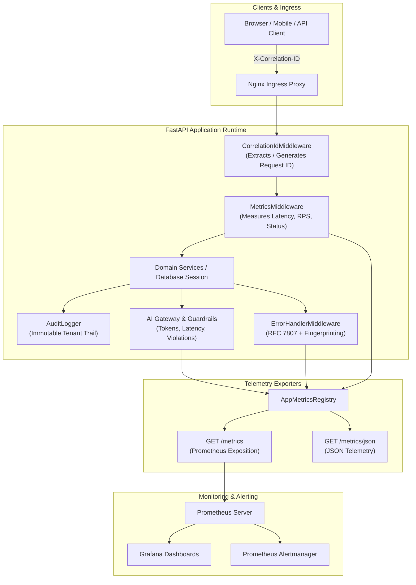

# VertexERP AI V2 - Production Observability & Telemetry Manual

**Document Identifier:** `VER-OPS-OBS-2026-09`  
**Target Environment:** Staging, Production  
**Status:** **OPERATIONAL & ACTIVE**

---

## 1. Executive Observability Architecture

VertexERP AI V2 implements a comprehensive, zero-trust telemetry pipeline built upon Google's **Four Golden Signals**:
- **Latency:** Measured via high-resolution histograms for HTTP, PostgreSQL queries, AI model inference, and background jobs.
- **Traffic:** Tracked across HTTP routes, background job queues, and AI token streams.
- **Errors:** Classified and fingerprinted under IETF RFC 7807 with automatic metric aggregation.
- **Saturation:** Monitored across database connection pools, Redis queues, and active worker threads.



---

## 2. Distributed Request Tracing & Correlation IDs

Every inbound HTTP request, background job execution, and outbound downstream request is stamped with a deterministic **Correlation ID**:
- **HTTP Header:** `X-Correlation-ID` and `X-Request-ID`.
- **Generation Logic:** If a client or upstream gateway provides an ID, it is preserved; otherwise, a unique token (`req_<hex_uuid>`) is minted.
- **Context Propagation:** Stored in thread-safe Python `ContextVars` ([`app/core/context.py`](file:///c:/Users/ExcelR/Music/VertexERP-AI/reference project/app/core/context.py)) and automatically bound to structured log contexts.

---

## 3. Structured JSON Logging & PII Redaction Standards

### 3.1 Strict Sanitization Rules
Sensitive information is **strictly stripped** before log records are formatted or outputted:
- **Keys Redacted:** `password`, `password_hash`, `token`, `access_token`, `refresh_token`, `secret`, `jwt_secret`, `totp_secret`, `api_key`, `credit_card`, `card_number`, `ssn`, `authorization`, `private_key`, `secret_key`, `bearer`, `cvv`, `pan`, `tax_identifier`, `bank_account`.
- **Inline Pattern Scrubbing:**
  - JWT Tokens: `eyJ...` $\rightarrow$ `[JWT_REDACTED]`
  - Authorization Bearer: `Bearer ...` $\rightarrow$ `Bearer [REDACTED]`
  - Credit Cards: `\d{4}[ -]?\d{4}[ -]?\d{4}[ -]?\d{4}` $\rightarrow$ `[CARD_REDACTED]`
  - SSN: `\d{3}-\d{2}-\d{4}` $\rightarrow$ `[SSN_REDACTED]`
  - API Keys: `sk_...` $\rightarrow$ `[APIKEY_REDACTED]`

### 3.2 Sample Structured Log Output
```json
{
  "event": "Sales Order created successfully",
  "level": "info",
  "logger": "vertexerp.crm.sales_order",
  "timestamp": "2026-09-11T12:00:00.123456Z",
  "environment": "production",
  "correlation_id": "req_8f12a3b4c5d6",
  "tenant_id": "3fa85f64-5717-4562-b3fc-2c963f66afa6",
  "user_id": "7ca85f64-5717-4562-b3fc-2c963f66af11",
  "order_id": "SO-2026-001",
  "total_amount": 259900.0,
  "credit_card": "[REDACTED]",
  "path": "/api/v1/crm/sales-orders",
  "method": "POST"
}
```

---

## 4. Application Metrics Catalog

Metrics are exposed at `GET /metrics` in standard Prometheus text format:

| Metric Name | Type | Labels | Description |
| :--- | :---: | :--- | :--- |
| `http_requests_total` | Counter | `method`, `path`, `status` | Total HTTP requests processed. |
| `http_request_duration_seconds` | Histogram | `method`, `path` | Request execution latency distribution. |
| `http_requests_in_progress` | Gauge | `method` | Active in-flight requests. |
| `db_query_duration_seconds` | Histogram | `operation`, `table` | Database query latency distribution. |
| `db_pool_size` | Gauge | — | Configured database pool connection size. |
| `db_pool_checked_out` | Gauge | — | Active checked-out database connections. |
| `db_pool_overflow` | Gauge | — | Connections opened beyond base pool. |
| `db_query_errors_total` | Counter | `operation`, `error_type` | Database query exceptions. |
| `worker_jobs_processed_total` | Counter | `job_type`, `status` | Completed/Failed background jobs. |
| `worker_job_duration_seconds` | Histogram | `job_type` | Background job execution latency. |
| `worker_queue_depth` | Gauge | — | Pending jobs in queue. |
| `worker_dead_letter_total` | Counter | `job_type` | Jobs routed to Dead Letter Queue (DLQ). |
| `ai_requests_total` | Counter | `provider`, `model`, `status` | Total AI inferences processed. |
| `ai_request_duration_seconds` | Histogram | `provider`, `model` | AI inference duration. |
| `ai_tokens_consumed_total` | Counter | `provider`, `model`, `type` | Prompt and completion tokens billed. |
| `ai_guardrail_blocks_total` | Counter | `violation_type` | Security injection blocks. |
| `app_errors_total` | Counter | `error_type`, `status_code`, `endpoint` | Intercepted application errors. |

---

## 5. Compliance Audit Logging Subsystem

Structured compliance audit records are generated for all state-changing operations via [`app/core/audit.py`](file:///c:/Users/ExcelR/Music/VertexERP-AI/reference project/app/core/audit.py):
- **Events Tracked:** `CREATE`, `UPDATE`, `DELETE`, `LOGIN`, `MFA_SETUP`, `ORG_SWITCH`, `EXPORT_DATA`, `DISPATCH_PRODUCTION`.
- **Payload Schema:** Includes `event_id`, `timestamp`, `tenant_id`, `user_id`, `action`, `resource_type`, `resource_id`, `status`, `correlation_id`, and `changes_summary`.

---

## 6. Operational Dashboards & Alerting Rules

### 6.1 Prometheus Alert Rules ([`infra/monitoring/prometheus/alerts.yml`](file:///c:/Users/ExcelR/Music/VertexERP-AI/reference project/infra/monitoring/prometheus/alerts.yml))
1. **`HighHttpErrorRate`**: Triggers if 5xx error rate exceeds 1% over 3 minutes.
2. **`HighHttpLatencyP99`**: Triggers if P99 API latency exceeds 1.5 seconds.
3. **`DatabasePoolNearExhaustion`**: Triggers if connection pool utilization exceeds 90%.
4. **`WorkerDeadLetterJobsDetected`**: Triggers when jobs exhaust retries and enter DLQ.
5. **`AIGuardrailViolationSpike`**: Triggers on prompt injection/jailbreak attacks.

### 6.2 Grafana Production Dashboard ([`infra/monitoring/grafana/dashboards/vertexerp_overview.json`](file:///c:/Users/ExcelR/Music/VertexERP-AI/reference project/infra/monitoring/grafana/dashboards/vertexerp_overview.json))
- Import `vertexerp_overview.json` directly into Grafana.
- Displays HTTP traffic, latency percentiles, database pool saturation, background worker throughput, AI token consumption, and error breakdowns.
